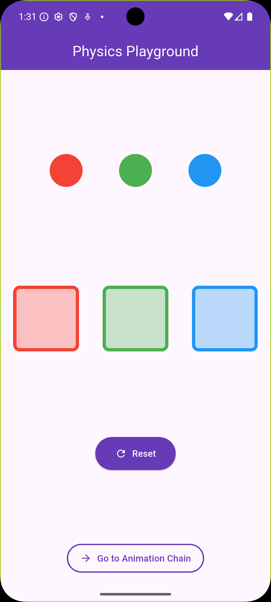
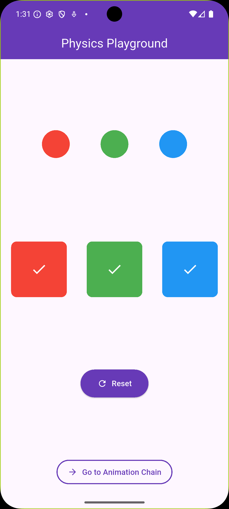
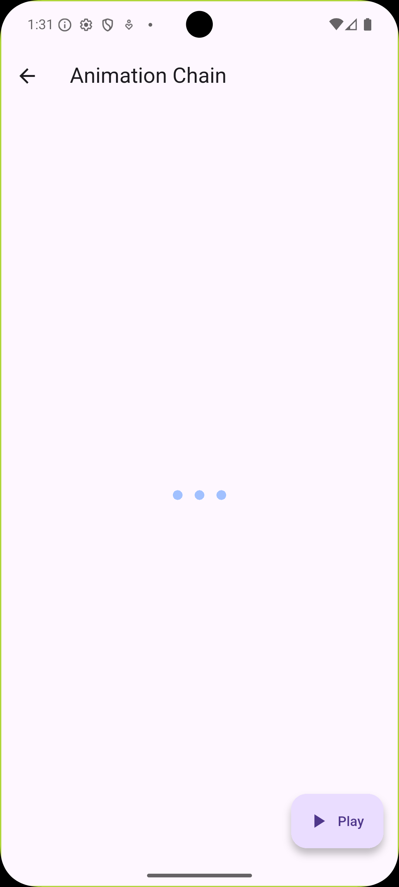
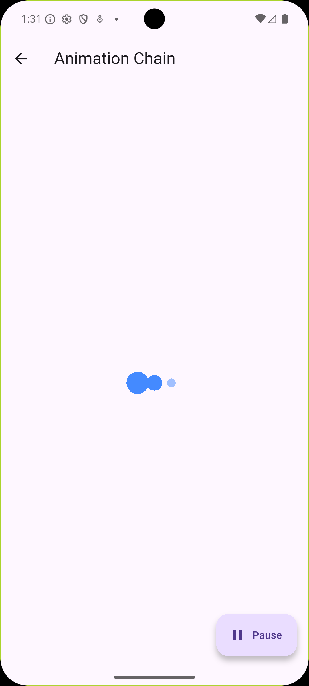

# 🎮 Physics Playground

An interactive Flutter application showcasing advanced UI interactions and smooth animations.

---

## ✨ Features

### 🎯 Drag & Drop Color Matching

Match colored circles to their corresponding targets with real-time visual feedback.

**Highlights:**

- Intuitive drag-and-drop mechanics
- Smart color validation
- Instant visual feedback (hover states, success indicators)
- One-tap reset functionality

### ⚡ Sequential Loading Animation

A mesmerizing loading sequence featuring three animated dots with smooth transitions.

**Highlights:**

- Sequential scale and opacity animations
- Play/Pause control with extended FAB
- Continuous loop animation
- Optimized performance with TweenAnimationBuilder

---

## 📱 Screenshots

### Drag & Drop Game

<table>
  <tr>
    <td></td>
    <td></td>
  </tr>
  <tr>
    <td align="center">Initial State</td>
    <td align="center">All Colors Matched</td>
  </tr>
</table>

### Loading Animation

<table>
  <tr>
    <td></td>
    <td></td>
  </tr>
  <tr>
    <td align="center">Ready State</td>
    <td align="center">Animation Playing</td>
  </tr>
</table>

---

## 🛠️ Technical Implementation

**Built with:**

- Flutter 3.x
- Dart
- Material Design 3

**Key Widgets:**

- `Draggable` & `DragTarget`
- `TweenAnimationBuilder`
- `AnimatedContainer`
- `Transform.scale`
- Custom state management

---

## 🚀 Getting Started

### Prerequisites

```bash
flutter --version  # Requires Flutter 3.0+
```

### Installation

```bash
git clone https://github.com/zicoovic/physics_playground
cd physics_playground
flutter pub get
flutter run
```

---

## 📂 Project Structure

```
lib/
├── main.dart                    # Drag & Drop Game
└── animation_chain_screen.dart  # Loading Animation

screenshots/
├── drag_empty.png
├── drag_completed.png
├── animation_idle.png
└── animation_playing.png
```

---

## 🎨 Design Decisions

- **Deep Purple Theme**: Professional and modern color scheme
- **Smooth Transitions**: 200-300ms animations for optimal UX
- **Visual Feedback**: Clear indicators for user interactions
- **Minimalist UI**: Focus on core functionality

---

## 🔮 Future Enhancements

- [ ] Add haptic feedback
- [ ] Implement score tracking system
- [ ] Multiple difficulty levels
- [ ] Sound effects and background music
- [ ] More animation patterns
- [ ] Dark mode support

---

## 👨‍💻 Author

**[Abdelrahman mohamed]**

- GitHub: [@zicoovic]
- Email: <abdelrhmanzakariaqa@gmail.com>

---

## 🙏 Acknowledgments

- Flutter team for amazing framework
- Material Design guidelines
- Community feedback and support

---

⭐ **If you like this project, please give it a star!**
